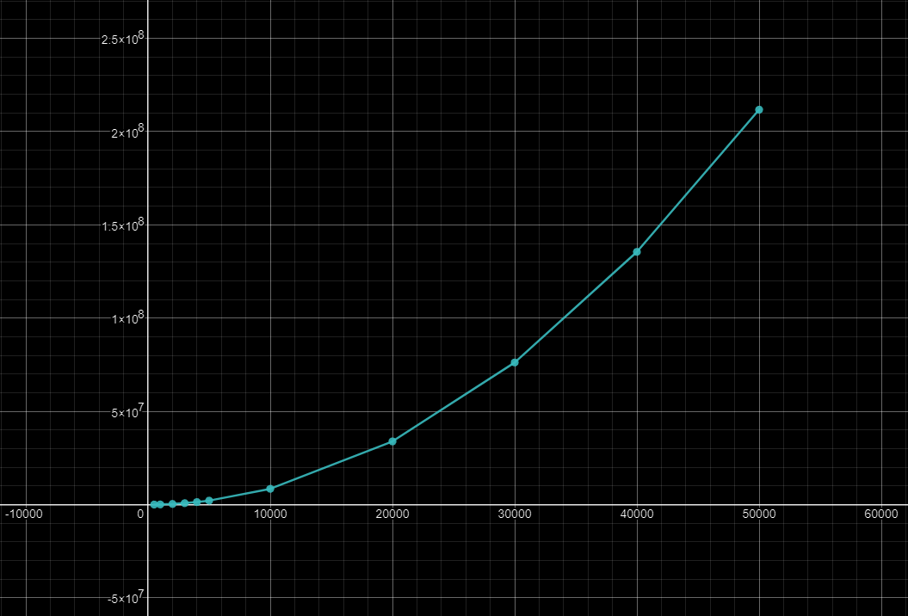
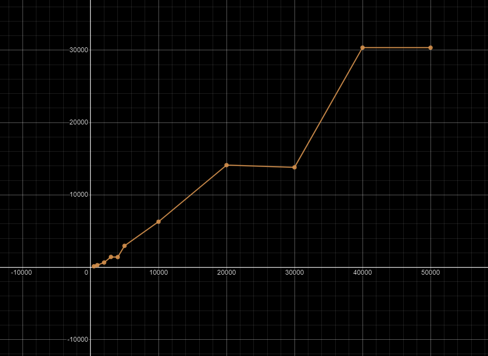
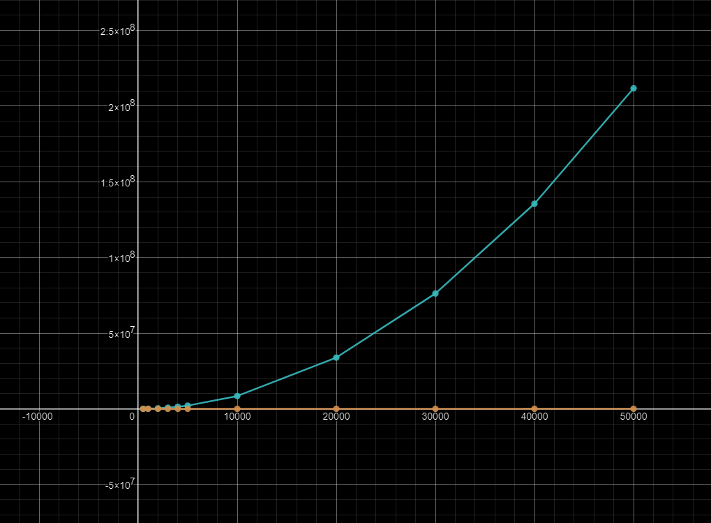

# Дискретное преобразование Фурье
## Теоретическое введение
Природа сигнала непрерывна, но все оборудование дискретно, поэтому при любых попытках измерить сигнал, 
возможно получить только значение сигнала в какой-то момент времени. 
Однако, мы можем однозначно и без потерь оцифровать этот сигнал и получить дискретные значения в некоторых отсчетах. 
Для этого, по теореме Котельникова, необходимо получать значения сигнала с частотой,
большей или равной чем удвоенная частота оцифровываемого сигнала. 
Таким образом задача анализа сигнала с помощью преобразования Фурье сводится к 
выполнению дискретного преобразования Фурье над некоторым массивом. 
Каждый элемент массива это значение сигнала, взятое с определенной частотой дискретизации. 
С помощью этого преобразования можно перейти от стандартного временного представления к амплитудному представлению
Такое представление крайне удобно и используется в обработке сигналов. С его помощью можно разложить сложный
сигнал на набор простых гармоник, а затем обрабатывать или передавать его. 
Для возвращения к стандартному временному представлению используется формула обратного преобразования.

## Описание алгоритма дискретного преобразования Фурье

Для понимания быстрого преобразования Фурье необходимо рассказать про дискретное преобразование Фурье,
так как оба алгоритма делают одно и тоже, но дискретное преобразование гораздо проще чем быстрое,
а начинать лучше с простого. Формула прямого преобразования:

$$
X_k = \sum_{n=0}^{N-1}x_ne^\frac{-i2\pi kn}{N}
$$

Где N - количество отсчетов, а k - число в интервале от 0 до N - 1. Очевидно, что максимальное значение k равно N - 1. 
Эту формулу можно представить как 2 цикла, где внешний цикл идет по k, а внутренний по n, или так как, 
дискретное преобразование Фурье является линейным преобразованием, его можно представить как умножение вектора временных отсчетов на матрицу.
Поэтому оба цикла будут одинаковой длины, а матрица будет квадратной.

$$
{\displaystyle {\vec {X}}={\mathcal {F}}{\vec {x}}}
$$

Матрица преобразования выглядит так:    

```math
{\mathcal {F}}={\frac {1}{\sqrt {n}}}{\begin{pmatrix}1&1&1&1&\ldots &1\\1&\omega _{n}&\omega _{n}^{2}&\omega _{n}^{3}&\ldots &\omega _{n}^{n-1}\\1&\omega _{n}^{2}&\omega _{n}^{4}&\omega _{n}^{6}&\ldots &\omega _{n}^{2(n-1)}\\1&\omega _{n}^{3}&\omega _{n}^{6}&\omega _{n}^{9}&\ldots &\omega _{n}^{3(n-1)}\\\vdots &\vdots &\vdots &\vdots &\ddots &\vdots \\1&\omega _{n}^{n-1}&\omega _{n}^{2(n-1)}&\omega _{n}^{3(n-1)}&\ldots &\omega _{n}^{(n-1)^{2}}\end{pmatrix}}
```

А элементы матрицы выглядят так:

$$
{\displaystyle {\mathcal {F}}(j,k)=\omega _{n}^{(j-1)(k-1)}, {\displaystyle \omega _{n}=e^{-{\frac {2\pi i}{n}}}}}
$$

Что можно упростить до:

$$
{\displaystyle {\mathcal {F}}(j,k)=e^{-\frac {2\pi i}{n}{(j-1)(k-1)}}}
$$

И в тригонометрическом виде:

$$
{\displaystyle {\mathcal {F}}(j,k).re=xcos(\frac{2\pi k n}{N})}
$$
$$
{\displaystyle {\mathcal {F}}(j,k).im=-xsin(\frac{2\pi k n}{N})}
$$

Так как в *c++* нет представления мнимого числа по умолчанию, в код будет использоваться тригонометрическое представления комплексного числа,
т.е для расчета действительной части комплексного числа будет использоваться $cos(2\pi n)$, а для мнимой части $sin(2\pi n)$. 
### Программная реализация дискретного преобразования Фурье на языке c++ 
Теперь, когда понятен механизм рассчета, можно привести код.  
В стандартной библиотеке c++ вектором обозначается массив, т.е все его элементы располагаются в памяти последовательно, 
что обеспечивает скорость работы. Класс complex является самописным для удобства работы.

```c++
// Функция вернет вектор комлексных чисел
// Функция принимает константную ссылку на вектор беззнаковых 64 битных чисел
std::vector<complex> DFT(const std::vector<uint64_t>& x)
{
    std::vector<complex> X; // Создаем вектор 
    X.reserve(x.size()); // Резервируем память заранее, что бы не перевыделять ее в процессе работы программы несколько раз

    // Внешний цикл
    for (uint64_t k = 0; k < x.size(); ++k)
    {
        complex step; // Комплексное число, для добавления в вектор результата
        for (uint64_t n = 0; n < x.size(); ++n) // Внутренний цикл
        {
            step.Re += x[n] * cos((2 * PI * k * n) / x.size()); // Рассчет действительной части комплексного числа
            step.Im -= x[n] * sin((2 * PI * k * n) / x.size()); // Рассчет мнимой части комплексного числа
        }
        X.emplace_back(step); // Добавление нового элемента в конец вектора
    }
    return X; // Возвращение результата операции
}
```

С помощью данного кода можно провести прямое дискретное преобразование Фурье и получить массив комплексных чисел. 

### Обратное дискретное преобразование Фурье
Формула обратного преобразовния

$$
x_n = \frac{1}{N} \sum_{k=0}^{N-1}X_ke^\frac{i2\pi kn}{N}
$$

С ее помощью можно вернуться из частотного представления в временное.

### Описание алгоритма быстрого преобразования Фурье
Быстрое преобразование Фурье — это метод, позволяющий вычислять дискретное преобразование Фурье за время $O(nlog n)$

Проблема дискретного преобразования Фурье заключается в повторных вычеслениях. Для демонстрации можно привести матрицу дискретного преобразования

```math
{\mathcal {F}}={\frac {1}{\sqrt {n}}}{\begin{pmatrix}1&1&1&1&\ldots &1\\1&\omega _{n}&\omega _{n}^{2}&\omega _{n}^{3}&\ldots &\omega _{n}^{n-1}\\1&\omega _{n}^{2}&\omega _{n}^{4}&\omega _{n}^{6}&\ldots &\omega _{n}^{2(n-1)}\\1&\omega _{n}^{3}&\omega _{n}^{6}&\omega _{n}^{9}&\ldots &\omega _{n}^{3(n-1)}\\\vdots &\vdots &\vdots &\vdots &\ddots &\vdots \\1&\omega _{n}^{n-1}&\omega _{n}^{2(n-1)}&\omega _{n}^{3(n-1)}&\ldots &\omega _{n}^{(n-1)^{2}}\end{pmatrix}}
```

Как можно заметить, в матрице присутствуют одинаковые элементы, например $\omega_n^2$ или же $\omega_n^2$. 
Дискретное преобразование Фурье считает одни и те же данные очень много раз, а быстрое преобразование позволяет избежать повторных расчетов,
за счет чего можно ускорить вычисления с $O(N^2)$ до $O(NlogN)$.
Главной идеей быстрого преобразования Фурье является уменьшение количества расчетов, за счет чего удается снизить сложность алгоритма, 
а соответсвенно и время выполения программы. Это уменьшение происходит из-за рекурсии. Алгоритм делит исходный массив, 
на два равных массива и вызывает для каждого из них себя же, пока не дойдет до массива длины 1. После этого на каждом шаге рекурсии
будет выполняться цикл, добавляющий коэффициенты из дискретного преобразования.
Алгоритм имеет и другие оптимизации, ускоряющие его, например перестановка элементов и отказ от рекурсии. 
Также существуют аппаратные оптимизации и оптимизации языка программирования, 
благодаря ним тоже удается ускорить работу программы. Под аппаратными оптимизациями я имею ввиду использование векторизованных расчетов, 
с помощью SSE или AVX инструкций.

### Реализация быстрого преобразования Фурье на c++
Данная функция реализует быстрое преобразование Фурье, без использования каких либо дополнительных оптимизаций и не рекомендуется
к использованию, так как следующая реализация во всем лучше этой.

```c++
// Данная функция ничего не возвращает, а результат будет записан в a
void FFT(std::vector<complex>& a) 
{
	int n = (int)a.size(); // Определение длины массива
	if (n == 1) return; // Если длина массива равна 1, то начинаем выход из рекурсии
 
	std::vector<complex> a0(n/2),  a1(n/2); // Два массива в два раза меньше чем массив функции, передающиеся в рекурсию
	for (int i=0, j=0; i<n; i+=2, ++j) // Заполнение двух массивов. В a0 идут четные, в a1 идут нечетные
    {
		a0[j] = a[i];
		a1[j] = a[i+1];
	}

	fft (a0); // Вызываем эту же функцию для половины массива
	fft (a1); // Выйдем из этих функций, когда в a0 и a1 будет лежать по одному элементу
 
	double ang = 2 * PI / n ; // Считаем коэффициент
	complex w(1), wn(cos(ang), sin(ang)); // Создаем два комплексных числа
	for (int i = 0; i < n / 2; ++i) // Проходим по всем внутренним массивам рекурсии
    {
        // Все действия эквиваленты умножению элементов в дискретном преобразовании
		a[i] = a0[i] + w * a1[i]; // Проходим по первой половине массива и добавляем к каждому элементу коэффициент
		a[i + n / 2] = a0[i] - w * a1[i]; // Проходим по второй половине массива и добавляем к каждому элементу коэффициент
		w *= wn; // Изменяем коэффициент
	}
}
```

Данная реализация сокращает количество операций с $N^2$ до $NlogN$

### Улучшенная реализация быстрого преобразования Фурье на c++
Для оптимизации откажемся от рекурсии, благодаря чему мы избавимся от всех накладных расходов на создание
новых массивов, выделения памяти и вызовов функций. Все расчеты и изменения будут проходить в исходных ячейках памяти.
Заметим, что с помощью двоичного представления индекса элемента в массиве, можно определить в каком массиве он будет 
на каждой итерации рекурсивного цикла. Например элемент с индексом *101* (5) на первой итерации попадет в нечетный массив,
на второй итерации он будет иметь индекс *01* во внутреннем массиве и попадет в четный массив.  
Пример для 8 элементов:
<table>
    <thead>
        <tr>
            <th>Исходное состояние</th>
            <th>Первая итерация</th>
            <th>Вторая итерация</th>
        </tr>
    </thead>
    <tbody>
        <tr>
            <td rowspan=4 align="center">0 (000)<br>1 (001)<br>2 (010)<br>3 (011)<br>4 (100)<br>5 (101)<br>6 (110)<br>7 (111)</td>
            <td rowspan=2 align="center">0 (000)<br>2 (010)<br>4 (100)<br>6 (110)</td>
            <td align="center">0 (000)<br>4 (100)</td>
        </tr>
        <tr>
            <td align="center">2 (010)<br>6 (110)</td>
        </tr>
        <tr>
            <td rowspan=2 align="center">1 (001)<br>3 (011)<br>5 (101)<br>7 (111)</td>
            <td align="center">1 (001)<br>5 (101)</td>
        </tr>
        <tr>
            <td align="center">3 (011)<br>7 (111)</td>
        </tr>
    </tbody>
</table>

Инвертируем порядок бит каждого числа и отсортируем результат

|Исходное состояние|Инвертированное состояние|Отсортированный результат|
|:----------------:|:-----------------------:|:-----------------------:|
|0 (000)           |(000)                    |0 (000)                  |
|1 (001)           |(100)                    |4 (100)                  |
|2 (010)           |(010)                    |2 (010)                  |
|3 (011)           |(110)                    |6 (110)                  |
|4 (100)           |(001)                    |1 (001)                  |
|5 (101)           |(101)                    |5 (101)                  |
|6 (110)           |(011)                    |3 (011)                  |
|7 (111)           |(111)                    |7 (111)                  |

С помощью этого алгоритма можно избавиться от рекурсии, так как теперь надо будет только проходить по массиву
по 2, 4, 8... элементов.
Для такой инверсии используется следующая функция:

```c++
// Функция обозначена как inline, так как это позволит избежать разрыва контекста при вызове функции
// Функция принимает число для инверсии и длину значащих бит, так как размерность числа может быть
// гораздо больше, чем требуется для инверсии
inline int64_t InverseNumber(int64_t number, int64_t numberSize)
{
    int64_t res = 0; // Переменная для хранения результата
    for (int i = 0; i < numberSize; ++i) // Цикл для обработки необходимого количества бит
    {
        res += number & 1; // Добавляем в res младший бит number
        number >>= 1; // Сдвигаем number на один бит вправо
        res <<= 1; // Сдвигаем res на один бит влево, в младшем бите будет 0
    }
    res >>= 1; // Сдвигам res направо, так как в последней итерации цикла мы сдвинули его лишний раз
    return res;
}
```

Из-за такого подхода, размерность массива значений должна быть степенью двойки. Если исходные данные меньше, то программа должна произвести выравнивание.

Второй оптимизацией является предрасчет всех тригонометрических значений, используемых в коэффициентах.
Несмотря на то, что элементы вектора считаются один раз, все тригонометрические коэффициенты считались несколько раз.
Коэффициенты представимы в виде тригонометрических функций. Очевидно, что все они будут располагаться на комплексном круге,
а количество корней будет зависить от количества элемент в массиве.

$$
{\displaystyle xcos(\frac{2\pi k n}{N})}
$$
$$
{\displaystyle xsin(\frac{2\pi k n}{N})}
$$

В этой реализации они рассчитываются один раз.  

```c++
// Функция шаблонная, что позволяет ей принимать вектор любого целочисленного типа
// Функция принимает константную ссылку на вектор целочисленных значений
// Функция возвращает вектор комплексных значений
template <class T>
std::vector<complex> FFT(const std::vector<T>& x)
{
    const int64_t recursiveLen = ceil(log2(x.size())); // Вычесление степени двойки для длины выравненого массив
    const int64_t arrLen = pow(2, recursiveLen); // Вычесление длины выравненого массив

    // Создание вектора необходимой длины
    std::vector<complex> res(arrLen - x.size());
    res.insert(res.end(), x.begin(), x.end());

    // Служебные переменные
    int64_t newPos;
    complex srcVal;

    // Инверсия элементов в векторе
    for (int64_t i = 0; i < arrLen; ++i)
    {
        newPos = InverseNumber(i, recursiveLen); // Получение инвертированного числа

        // Проверяем что текущее число меньше новой позиции, так как иначе это будет обозначать что текущее число уже было заменено
        // Проверяем что текещее число не равно новой позиции, так как тогда перестановки не будет
        if (i < newPos && newPos != i)
        {
            // Перестановка двух элементов
            srcVal = res[i];
            res[i] = res[newPos];
            res[newPos] = srcVal;
        }
    }

    // Переиенная для хранения половины длины массива. В данный момент времени используется для предрасчета тригономитрических коэффициентов
    // Делим на 8, так как 4 четверти по 2 элемента
    int64_t halfElem = arrLen / 8;
    // Массив для записи результата работы внешнего цикла
    std::vector<complex> tmp(arrLen);
    // Массив для хранения значений тригономитрических коэффициентов
    std::vector<complex> w(arrLen / 2);


    // Считаем нулевые значения
    w[0].Re = 1;
    w[0].Im = 0;

    // Считаем срединные значения
    w[arrLen / 4].Re = cos(2 * PI * (arrLen / 4) / arrLen);
    w[arrLen / 4].Im = -sin(2 * PI * (arrLen / 4) / arrLen);

    // Считаем первую и четвертую четверть
    //         |   x = 1
    //         |  
    //    -----------
    //         |
    //         |   x = 4
    for (int64_t i = 1; i <= halfElem; ++i)
    {
        // 1 четверть
        w[i].Re = cos(2 * PI * i / arrLen);
        w[i].Im = -sin(2 * PI * i / arrLen);

        // 4 четверть
        w[w.size() - i].Re = -w[i].Re;
        w[w.size() - i].Im = w[i].Im;
    }

    // Считаем вторую и третью четверть
    // 2 = x   |   
    //         |  
    //    -----------
    //         |
    // 3 = x   |   
    for (int64_t i = 1; i < halfElem; ++i)
    {
        // 2 четверть
        w[halfElem + i].Re = -w[(halfElem - i) % halfElem].Im;
        w[halfElem + i].Im = -w[(halfElem - i) % halfElem].Re;

        // 3 четверть
        w[w.size() - 2 * halfElem + i].Re = w[i].Im;
        w[w.size() - 2 * halfElem + i].Im = -w[i].Re;
    }

    int64_t elemCount = 2;
    // Цикл псевдорекурсии
    for (int64_t i = 0; i < recursiveLen; ++i)
    {
        // Обновляем счетчик половины длины
        halfElem = elemCount / 2;

        // Проходим по всему массиву
        for (int64_t j = 0; j < arrLen; j += elemCount)
        {
            // Проходим по каждому набору элементов, длины 2, 4, 8... в зависимости от текущего шага псевдорекурсии
            for (int64_t k = 0; k < halfElem; ++k)
            {
                // Записываем новые данные в временный массив
                tmp[j + k] = res[j + k] + w[k * (arrLen / elemCount)] * res[j + k + halfElem];
                tmp[j + halfElem + k] = res[j + k] - w[k * (arrLen / elemCount)] * res[j + k + halfElem];
            }
        }

        res = tmp; // Обновляем исходный массив
        elemCount <<= 1; // Увеличиваем счетчик размера внутренних массивов
    }

    return res; // Возвращаем результат
}
```

### Другие реализации быстрого преобразования Фурье
Существует реализация через модульную арифметику, она работает медленнее, но не имеет погрешности. На данный момент у меня нет ее реализации.

## Практические тесты

### Сравнение дискретного преобразования Фурье и быстрого преобразования Фурье

Так как предрасчеты сильно ускоряют работу программы, в сравнении двух алгоритмов используется 
реализация без них.

#### C++ O0

Начнем сравнение двух алгоритмов с c++ реализаций, собранных без оптимизаций.
Сравнение без оптимизаций имеет смысл, так как при нем можно оценить "голую"
эффективность алгоритмов, без каких либо оптимизаций со стороны компилятора,
что позволит произвести тесты алгоритмов с минимальным влиянием программных средств.

Характеристики системы: Windows 10 22H2, Intel Core i7 7700k, частота процессора 4.6 ГГц.
В качестве компилятора используется mingw

|Размер входного массива|ДПФ, мкс |БПФ, мкс|
|-----------------------|---------|--------|
|500                    |21229    |131     |
|1000                   |84652    |289     |
|2000                   |339225   |654     |
|3000                   |761710   |1426    |
|4000                   |1353556  |1402    |
|5000                   |2127030  |2955    |
|10000                  |8463980  |6292    |
|20000                  |33885538 |14110   |
|30000                  |76189102 |13808   |
|40000                  |135509778|30349   |
|50000                  |211743663|30342   |

Построим графики зависимости времени выполнения от количества элементов

График дискретного преобразования Фурье


График быстрого преобразования Фурье


Общий график


Расчет коэффициентов увеличения времени и количества элементов для оценки сложности алгоритмов. 

|Размер входного массива|Коэффициент увеличения количества элементов|ДПФ, коэффициент увеличения времени|БПФ, коэффициент увеличения времени|
|-----------------------|-------------------------------------------|-----------------------------------|-----------------------------------|
|500                    |0                                          |0                                  |0                                  |
|1000                   |2                                          |3.987                              |2.206                              |
|2000                   |2                                          |4                                  |2.262                              |
|3000                   |1.5                                        |2.245                              |2.180                              |
|4000                   |1.333                                      |1.776                              |0.983                              |
|5000                   |1.25                                       |1.571                              |2.107                              |
|10000                  |2                                          |3.979                              |2.129                              |
|20000                  |2                                          |4.003                              |2.242                              |
|30000                  |1.5                                        |2.248                              |0.978                              |
|40000                  |1.333                                      |1.778                              |2.197                              |
|50000                  |1.25                                       |1.562                              |0.999                              |


<span style="color:red">
На самом деле данный тест не совсем честный, так как БПФ работает с данными, длина которых кратна степени двойки. 
Поэтому для массивов длины 3000 и 4000 наблюдается некая аномалия,
когда для меньшего по размеру массива вычесления занимают больше времени. 
Это связано с выравниванием, так как БПФ выравняет 3000 и 4000 до 4096. 
Расчет массива на 3000 элементов занимает больше времени, так как для этого массива выравнивание занимает больше времени, чем для массива длины 4000.
Сделаем выводы по этому. 
Проведем еще один тест без паддинга.
</span>

Второй тест с O0
|Размер входного массива|ДПФ, мкс |БПФ, мкс|
|-----------------------|---------|--------|
|512                    |22293    |129     |
|1024                   |89435    |302     |
|2048                   |356207   |892     |
|4096                   |1433178  |1398    |
|8192                   |5713967  |2904    |
|16384                  |22825300 |6077    |
|32768                  |91292209 |13650   |
|65536                  |365071609|30207   |

#### C++ O3

|Размер входного массива|ДПФ, мкс |БПФ, мкс|
|-----------------------|---------|--------|
|512                    |9792     |11      |
|1024                   |39230    |26      |
|2048                   |156343   |93      |
|4096                   |635276   |187     |
|8192                   |2504396  |412     |
|16384                  |10015253 |621     |
|32768                  |40009653 |2126    |
|65536                  |80391802 |4857    |

### Вывод
Очевидно, что при увеличении числа входных данных, будет увеличиваться разрыв времени выполнения между дискретным и быстрым
преобразованиями Фурье. Это подтверждает эффективность алгоритма и эффективность всех оптимизаций. 
