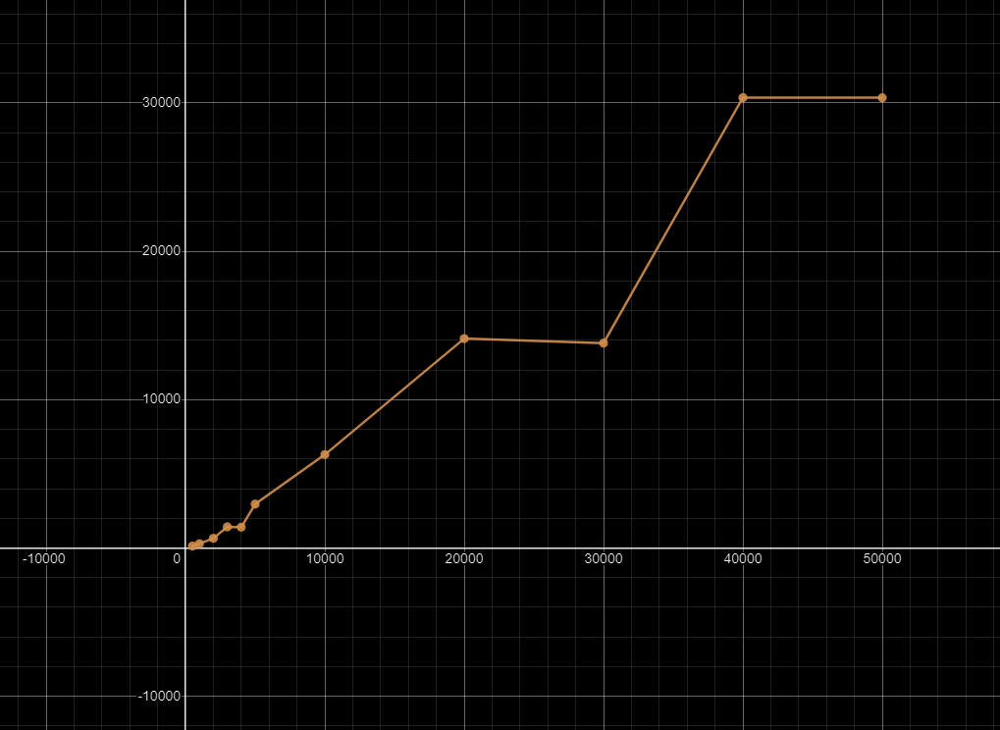

# Дискретное преобразование Фурье
## Теоретическое введение
Природа сигнала непрерывна, но все оборудование дискретно, поэтому при любых попытках измерить сигнал, 
возможно получить только значение сигнала в какой-то момент времени. 
Однако, мы можем однозначно и без потерь оцифровать этот сигнал и получить дискретные значения в некоторых отсчетах. 
Для этого, по теореме Котельникова, необходимо получать значения сигнала с частотой,
большей или равной чем удвоенная частота оцифровываемого сигнала. 
Таким образом задача анализа сигнала с помощью преобразования Фурье сводится к 
выполнению дискретного преобразования Фурье над некоторым массивом. 
Каждый элемент массива это значение сигнала, взятое с определенной частотой дискретизации. 
С помощью этого преобразования можно перейти от стандартного временного представления к амплитудному представлению
Такое представление крайне удобно и используется в обработке сигналов. С его помощью можно разложить сложный
сигнал на набор простых гармоник, а затем обрабатывать или передавать его. 
Для возвращения к стандартному временному представлению используется формула обратного преобразования.

## Описание алгоритма дискретного преобразования Фурье

Для понимания быстрого преобразования Фурье необходимо рассказать про дискретное преобразование Фурье,
так как оба алгоритма делают одно и тоже, но дискретное преобразование гораздо проще чем быстрое,
а начинать лучше с простого. Формула прямого преобразования:

$$
X_k = \sum_{n=0}^{N-1}x_ne^\frac{-i2\pi kn}{N}
$$

Где N - количество отсчетов, а k - число в интервале от 0 до N - 1. Очевидно, что максимальное значение k равно N - 1. 
Эту формулу можно представить как 2 цикла, где внешний цикл идет по k, а внутренний по n, или так как, 
дискретное преобразование Фурье является линейным преобразованием, его можно представить как умножение вектора временных отсчетов на матрицу.
Поэтому оба цикла будут одинаковой длины, а матрица будет квадратной.

$$
{\displaystyle {\vec {X}}={\mathcal {F}}{\vec {x}}}
$$

Матрица преобразования выглядит так:    

```math
{\mathcal {F}}={\frac {1}{\sqrt {n}}}{\begin{pmatrix}1&1&1&1&\ldots &1\\1&\omega _{n}&\omega _{n}^{2}&\omega _{n}^{3}&\ldots &\omega _{n}^{n-1}\\1&\omega _{n}^{2}&\omega _{n}^{4}&\omega _{n}^{6}&\ldots &\omega _{n}^{2(n-1)}\\1&\omega _{n}^{3}&\omega _{n}^{6}&\omega _{n}^{9}&\ldots &\omega _{n}^{3(n-1)}\\\vdots &\vdots &\vdots &\vdots &\ddots &\vdots \\1&\omega _{n}^{n-1}&\omega _{n}^{2(n-1)}&\omega _{n}^{3(n-1)}&\ldots &\omega _{n}^{(n-1)^{2}}\end{pmatrix}}
```

А элементы матрицы выглядят так:

$$
{\displaystyle {\mathcal {F}}(j,k)=\omega _{n}^{(j-1)(k-1)}, {\displaystyle \omega _{n}=e^{-{\frac {2\pi i}{n}}}}}
$$

Что можно упростить до:

$$
{\displaystyle {\mathcal {F}}(j,k)=e^{-\frac {2\pi i}{n}{(j-1)(k-1)}}}
$$

И в тригонометрическом виде:

$$
{\displaystyle {\mathcal {F}}(j,k).re=xcos(\frac{2\pi k n}{N})}
$$
$$
{\displaystyle {\mathcal {F}}(j,k).im=-xsin(\frac{2\pi k n}{N})}
$$

Так как в *c++* нет представления мнимого числа по умолчанию, в код будет использоваться тригонометрическое представления комплексного числа,
т.е для расчета действительной части комплексного числа будет использоваться $cos(2\pi n)$, а для мнимой части $sin(2\pi n)$. 
### Программная реализация дискретного преобразования Фурье на языке c++ 
Теперь, когда понятен механизм рассчета, можно привести код.  
В стандартной библиотеке c++ вектором обозначается массив, т.е все его элементы располагаются в памяти последовательно, 
что обеспечивает скорость работы. Класс complex является самописным для удобства работы.

```c++
// Функция вернет вектор комлексных чисел
// Функция принимает константную ссылку на вектор беззнаковых 64 битных чисел
std::vector<complex> DFT(const std::vector<uint64_t>& x)
{
    std::vector<complex> X; // Создаем вектор 
    X.reserve(x.size()); // Резервируем память заранее, что бы не перевыделять ее в процессе работы программы несколько раз

    // Внешний цикл
    for (uint64_t k = 0; k < x.size(); ++k)
    {
        complex step; // Комплексное число, для добавления в вектор результата
        for (uint64_t n = 0; n < x.size(); ++n) // Внутренний цикл
        {
            step.Re += x[n] * cos((2 * PI * k * n) / x.size()); // Рассчет действительной части комплексного числа
            step.Im -= x[n] * sin((2 * PI * k * n) / x.size()); // Рассчет мнимой части комплексного числа
        }
        X.emplace_back(step); // Добавление нового элемента в конец вектора
    }
    return X; // Возвращение результата операции
}
```

С помощью данного кода можно провести прямое дискретное преобразование Фурье и получить массив комплексных чисел. 

### Обратное дискретное преобразование Фурье
Формула обратного преобразовния

$$
x_n = \frac{1}{N} \sum_{k=0}^{N-1}X_ke^\frac{i2\pi kn}{N}
$$

С ее помощью можно вернуться из частотного представления в временное.

### Описание алгоритма быстрого преобразования Фурье
Быстрое преобразование Фурье — это метод, позволяющий вычислять дискретное преобразование Фурье за время $O(nlog n)$

Проблема дискретного преобразования Фурье заключается в повторных вычеслениях. Для демонстрации можно привести матрицу дискретного преобразования

```math
{\mathcal {F}}={\frac {1}{\sqrt {n}}}{\begin{pmatrix}1&1&1&1&\ldots &1\\1&\omega _{n}&\omega _{n}^{2}&\omega _{n}^{3}&\ldots &\omega _{n}^{n-1}\\1&\omega _{n}^{2}&\omega _{n}^{4}&\omega _{n}^{6}&\ldots &\omega _{n}^{2(n-1)}\\1&\omega _{n}^{3}&\omega _{n}^{6}&\omega _{n}^{9}&\ldots &\omega _{n}^{3(n-1)}\\\vdots &\vdots &\vdots &\vdots &\ddots &\vdots \\1&\omega _{n}^{n-1}&\omega _{n}^{2(n-1)}&\omega _{n}^{3(n-1)}&\ldots &\omega _{n}^{(n-1)^{2}}\end{pmatrix}}
```

Как можно заметить, в матрице присутствуют одинаковые элементы, например $\omega_n^2$ или же $\omega_n^2$. 
Дискретное преобразование Фурье считает одни и те же данные очень много раз, а быстрое преобразование позволяет избежать повторных расчетов,
за счет чего можно ускорить вычисления с $O(n^2)$ до $O(nlogn)$.
Главной идеей быстрого преобразования Фурье является уменьшение количества расчетов, за счет чего удается снизить сложность алгоритма, 
а соответсвенно и время выполения программы. Это уменьшение происходит из-за рекурсии. Алгоритм делит исходный массив, 
на два равных массива и вызывает для каждого из них себя же, пока не дойдет до массива длины 1. После этого на каждом шаге рекурсии
будет выполняться цикл, добавляющий коэффициенты из дискретного преобразования.
Алгоритм имеет и другие оптимизации, ускоряющие его, например перестановка элементов и отказ от рекурсии. 
Также существуют аппаратные оптимизации и оптимизации языка программирования, 
благодаря ним тоже удается ускорить работу программы. Под аппаратными оптимизациями я имею ввиду использование векторизованных расчетов, 
с помощью SSE или AVX инструкций.

### Реализация быстрого преобразования Фурье на c++
Данная функция реализует быстрое преобразование Фурье, без использования каких либо дополнительных оптимизаций и не рекомендуется
к использованию, так как следующая реализация во всем лучше этой.

```c++
// Данная функция ничего не возвращает, а результат будет записан в a
void FFT(std::vector<complex>& a) 
{
	int n = (int)a.size(); // Определение длины массива
	if (n == 1) return; // Если длина массива равна 1, то начинаем выход из рекурсии
 
	std::vector<complex> a0(n/2),  a1(n/2); // Два массива в два раза меньше чем массив функции, передающиеся в рекурсию
	for (int i=0, j=0; i<n; i+=2, ++j) // Заполнение двух массивов. В a0 идут четные, в a1 идут нечетные
    {
		a0[j] = a[i];
		a1[j] = a[i+1];
	}

	fft (a0); // Вызываем эту же функцию для половины массива
	fft (a1); // Выйдем из этих функций, когда в a0 и a1 будет лежать по одному элементу
 
	double ang = 2 * PI / n ; // Считаем коэффициент
	complex w(1), wn(cos(ang), sin(ang)); // Создаем два комплексных числа
	for (int i = 0; i < n / 2; ++i) // Проходим по всем внутренним массивам рекурсии
    {
        // Все действия эквиваленты умножению элементов в дискретном преобразовании
		a[i] = a0[i] + w * a1[i]; // Проходим по первой половине массива и добавляем к каждому элементу коэффициент
		a[i + n / 2] = a0[i] - w * a1[i]; // Проходим по второй половине массива и добавляем к каждому элементу коэффициент
		w *= wn; // Изменяем коэффициент
	}
}
```

Данная реализация сокращает количество операций с $N^2$ до $NlogN$

### Улучшенная реализация быстрого преобразования Фурье на c++
Для оптимизации откажемся от рекурсии, благодаря чему мы избавимся от всех накладных расходов на создание
новых массивов, выделения памяти и вызовов функций. Все расчеты и изменения будут проходить в исходных ячейках памяти.
Заметим, что с помощью двоичного представления индекса элемента в массиве, можно определить в каком массиве он будет 
на каждой итерации рекурсивного цикла. Например элемент с индексом *101* (5) на первой итерации попадет в нечетный массив,
на второй итерации он будет иметь индекс *01* во внутреннем массиве и попадет в четный массив.  
Пример для 8 элементов:
<table>
    <thead>
        <tr>
            <th>Исходное состояние</th>
            <th>Первая итерация</th>
            <th>Вторая итерация</th>
        </tr>
    </thead>
    <tbody>
        <tr>
            <td rowspan=4 align="center">0 (000)<br>1 (001)<br>2 (010)<br>3 (011)<br>4 (100)<br>5 (101)<br>6 (110)<br>7 (111)</td>
            <td rowspan=2 align="center">0 (000)<br>2 (010)<br>4 (100)<br>6 (110)</td>
            <td align="center">0 (000)<br>4 (100)</td>
        </tr>
        <tr>
            <td align="center">2 (010)<br>6 (110)</td>
        </tr>
        <tr>
            <td rowspan=2 align="center">1 (001)<br>3 (011)<br>5 (101)<br>7 (111)</td>
            <td align="center">1 (001)<br>5 (101)</td>
        </tr>
        <tr>
            <td align="center">3 (011)<br>7 (111)</td>
        </tr>
    </tbody>
</table>

Инвертируем порядок бит каждого числа и отсортируем результат

|Исходное состояние|Инвертированное состояние|Отсортированный результат|
|:----------------:|:-----------------------:|:-----------------------:|
|0 (000)           |(000)                    |0 (000)                  |
|1 (001)           |(100)                    |4 (100)                  |
|2 (010)           |(010)                    |2 (010)                  |
|3 (011)           |(110)                    |6 (110)                  |
|4 (100)           |(001)                    |1 (001)                  |
|5 (101)           |(101)                    |5 (101)                  |
|6 (110)           |(011)                    |3 (011)                  |
|7 (111)           |(111)                    |7 (111)                  |

С помощью этого алгоритма можно избавиться от рекурсии, так как теперь надо будет только проходить по массиву
по 2, 4, 8... элементов.
Для такой инверсии используется следующая функция:

```c++
// Функция обозначена как inline, так как это позволит избежать разрыва контекста при вызове функции
// Функция принимает число для инверсии и длину значащих бит, так как размерность числа может быть
// гораздо больше, чем требуется для инверсии
inline int64_t InverseNumber(int64_t number, int64_t numberSize)
{
    int64_t res = 0; // Переменная для хранения результата
    for (int i = 0; i < numberSize; ++i) // Цикл для обработки необходимого количества бит
    {
        res += number & 1; // Добавляем в res младший бит number
        number >>= 1; // Сдвигаем number на один бит вправо
        res <<= 1; // Сдвигаем res на один бит влево, в младшем бите будет 0
    }
    res >>= 1; // Сдвигам res направо, так как в последней итерации цикла мы сдвинули его лишний раз
    return res;
}
```

Из-за такого подхода, размерность массива значений должна быть степенью двойки. Если исходные данные меньше, то программа должна произвести выравнивание.

Второй оптимизацией является предрасчет всех тригонометрических значений, используемых в коэффициентах.
Несмотря на то, что элементы вектора считаются один раз, все тригонометрические коэффициенты считались несколько раз.
Коэффициенты представимы в виде тригонометрических функций. Очевидно, что все они будут располагаться на комплексном круге,
а количество корней будет зависить от количества элемент в массиве.

$$
{\displaystyle xcos(\frac{2\pi k n}{N})}
$$
$$
{\displaystyle xsin(\frac{2\pi k n}{N})}
$$

В этой реализации они рассчитываются один раз.  

```c++
// Функция шаблонная, что позволяет ей принимать вектор любого целочисленного типа
// Функция принимает константную ссылку на вектор целочисленных значений
// Функция возвращает вектор комплексных значений
template <class T>
std::vector<complex> FFT(const std::vector<T>& x)
{
    const int64_t recursiveLen = ceil(log2(x.size())); // Вычесление степени двойки для длины выравненого массив
    const int64_t arrLen = pow(2, recursiveLen); // Вычесление длины выравненого массив

    // Создание вектора необходимой длины
    std::vector<complex> res(arrLen - x.size());
    res.insert(res.end(), x.begin(), x.end());

    // Служебные переменные
    int64_t newPos;
    complex srcVal;

    // Инверсия элементов в векторе
    for (int64_t i = 0; i < arrLen; ++i)
    {
        newPos = InverseNumber(i, recursiveLen); // Получение инвертированного числа

        // Проверяем что текущее число меньше новой позиции, так как иначе это будет обозначать что текущее число уже было заменено
        // Проверяем что текещее число не равно новой позиции, так как тогда перестановки не будет
        if (i < newPos && newPos != i)
        {
            // Перестановка двух элементов
            srcVal = res[i];
            res[i] = res[newPos];
            res[newPos] = srcVal;
        }
    }

    // Переиенная для хранения половины длины массива. В данный момент времени используется для предрасчета тригономитрических коэффициентов
    // Делим на 8, так как 4 четверти по 2 элемента
    int64_t halfElem = arrLen / 8;
    // Массив для записи результата работы внешнего цикла
    std::vector<complex> tmp(arrLen);
    // Массив для хранения значений тригономитрических коэффициентов
    std::vector<complex> w(arrLen / 2);


    // Считаем нулевые значения
    w[0].Re = 1;
    w[0].Im = 0;

    // Считаем срединные значения
    w[arrLen / 4].Re = cos(2 * PI * (arrLen / 4) / arrLen);
    w[arrLen / 4].Im = -sin(2 * PI * (arrLen / 4) / arrLen);

    // Считаем первую и четвертую четверть
    //         |   x = 1
    //         |  
    //    -----------
    //         |
    //         |   x = 4
    for (int64_t i = 1; i <= halfElem; ++i)
    {
        // 1 четверть
        w[i].Re = cos(2 * PI * i / arrLen);
        w[i].Im = -sin(2 * PI * i / arrLen);

        // 4 четверть
        w[w.size() - i].Re = -w[i].Re;
        w[w.size() - i].Im = w[i].Im;
    }

    // Считаем вторую и третью четверть
    // 2 = x   |   
    //         |  
    //    -----------
    //         |
    // 3 = x   |   
    for (int64_t i = 1; i < halfElem; ++i)
    {
        // 2 четверть
        w[halfElem + i].Re = -w[(halfElem - i) % halfElem].Im;
        w[halfElem + i].Im = -w[(halfElem - i) % halfElem].Re;

        // 3 четверть
        w[w.size() - 2 * halfElem + i].Re = w[i].Im;
        w[w.size() - 2 * halfElem + i].Im = -w[i].Re;
    }

    int64_t elemCount = 2;
    // Цикл псевдорекурсии
    for (int64_t i = 0; i < recursiveLen; ++i)
    {
        // Обновляем счетчик половины длины
        halfElem = elemCount / 2;

        // Проходим по всему массиву
        for (int64_t j = 0; j < arrLen; j += elemCount)
        {
            // Проходим по каждому набору элементов, длины 2, 4, 8... в зависимости от текущего шага псевдорекурсии
            for (int64_t k = 0; k < halfElem; ++k)
            {
                // Записываем новые данные в временный массив
                tmp[j + k] = res[j + k] + w[k * (arrLen / elemCount)] * res[j + k + halfElem];
                tmp[j + halfElem + k] = res[j + k] - w[k * (arrLen / elemCount)] * res[j + k + halfElem];
            }
        }

        res = tmp; // Обновляем исходный массив
        elemCount <<= 1; // Увеличиваем счетчик размера внутренних массивов
    }

    return res; // Возвращаем результат
}
```

### Другие реализации быстрого преобразования Фурье
Существует реализация через модульную арифметику, она работает медленнее, но не имеет погрешности. На данный момент у меня нет ее реализации.

## Практические тесты

Во всех тестах в качестве быстрого преобразования будет использоваться последняя реализация. 
Все программы собирались с ключом O3. Компилятор MinGW
Система: Windows 10 22H2, Intel Core I7 7700k, время в таблицах в микросекундах

### Сравнение дискретного преобразования Фурье и быстрого преобразования Фурье


|Размер входного массива|ДПФ      |БПФ |
|-----------------------|---------|----|
|1000                   |37212    |44  |
|5000                   |927496   |409 |
|10000                  |3723537  |910 |
|30000                  |33720629 |2824|
|65536                  |159462528|4446|

Для наглядности графики:

Дискретное преобразование Фурье


Быстрое преобразование Фурье


Совместный график


### Вывод
Очевидно, что при увеличении числа входных данных, будет увеличиваться разрыв времени выполнения между дискретным и быстрым
преобразованиями Фурье. Это подтверждает эффективность алгоритма и эффективность всех оптимизаций. 
